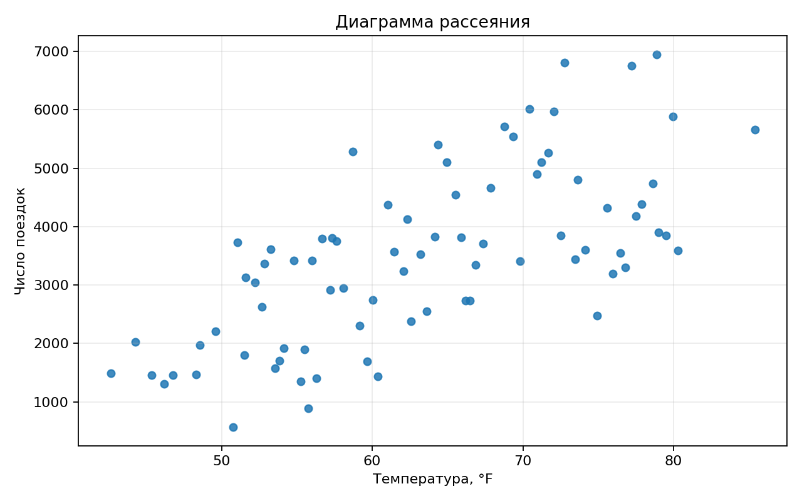
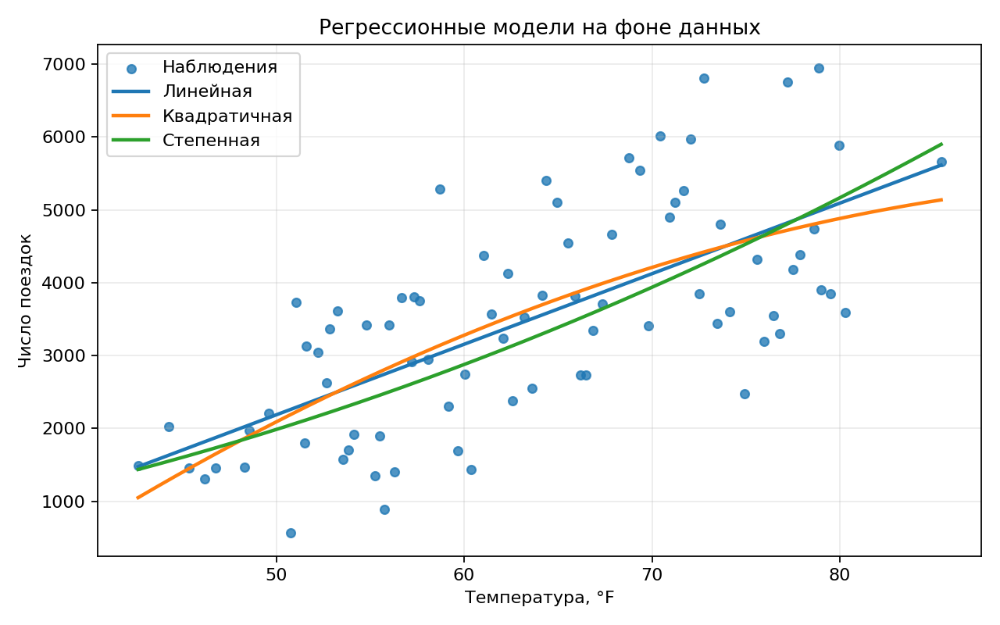
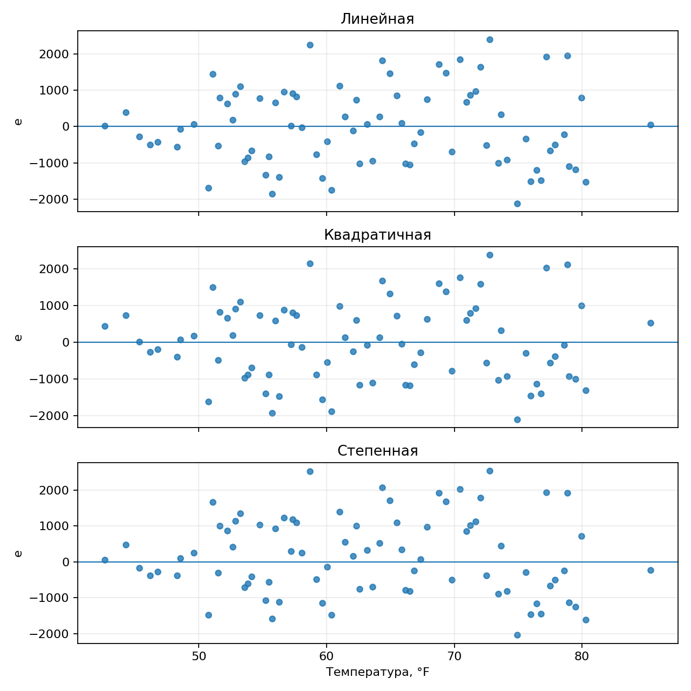

# Расчётно-графическая работа №3

## Вариант D-1

**Переменные:** `x` — температура, `F`; `y` — число поездок.  

**Прогнозное значение:**

```math
x^* = 67.7863.
```

## Исходные данные

```math
n = 80, \qquad \alpha = 0.05.
```

| Характеристика | x | y |
|---|---:|---:|
| Выборочное среднее | 63.35170 | 3480.01250 |
| Несмещённая дисперсия | 109.90253 | 2210266.59478 |
| Несмещённое стандартное отклонение | 10.48344 | 1486.69654 |
| Медиана | 62.87301 | 3486.50000 |
| Минимум | 42.65288 | 570.00000 |
| Максимум | 85.38197 | 6946.00000 |



По диаграмме рассеяния наблюдается положительная связь. Выборочный коэффициент корреляции: 0.68297.

## 1. Построение моделей

### 1.1. Линейная модель


```math

S_{xx} = \sum_{i=1}^{n}(x_i - \bar x)^2

\qquad

S_{xy} = \sum_{i=1}^{n}(x_i - \bar x)(y_i - \bar y)

\qquad

\hat b = \frac{S_{xy}}{S_{xx}}

\qquad

\hat a = \bar y - \hat b \bar x

\qquad

\hat y = \hat a + \hat b x

```

```math
\hat a = -2655.84807, \qquad \hat b = 96.85392.
```

Итоговое уравнение:

```math
\hat y = -2655.84807 + 96.85392x.
```

### 1.2. Квадратичная модель

```math

\hat y = a + bx + cx^2

\qquad

\frac{\partial RSS}{\partial a} = 0

\qquad

\frac{\partial RSS}{\partial b} = 0

\qquad

\frac{\partial RSS}{\partial c} = 0

\qquad

RSS = \sum_{i=1}^{n}(y_i - \hat y_i)^2

```

```math
\hat a = -7745.24079, \qquad \hat b = 261.47953, \qquad \hat c = -1.29548.
```

Итоговое уравнение:

```math
\hat y = -7745.24079 + 261.47953x - 1.29548x^2.
```

### 1.3. Степенная модель

```math

\hat y = ax^b

\qquad

\ln y = \ln a + b \ln x

\qquad

Y = \alpha + bX

\qquad

Y = \ln y,\qquad X = \ln x

\qquad

a = e^{\alpha}

```

Линеаризация:

```math
\ln y = \ln a + b\ln x.
```

```math
\hat a = 0.69423, \qquad \hat b = 2.03444.
```

Итоговое уравнение:

```math
\hat y = 0.69423x^{2.03444}.
```



## 2. Сравнение моделей

| Модель | RSS | R² | RMSE | A, % |
|---|---:|---:|---:|---:|
| Линейная | 93165161.89081 | 0.46644 | 1079.14991 | 33.65282 |
| Квадратичная | 91612550.34711 | 0.47533 | 1070.12003 | 33.65132 |
| Степенная | 98667617.03657 | 0.43493 | 1110.56077 | 32.06476 |

По критериям R², RSS и RMSE лучшей является квадратичная модель. По средней ошибке аппроксимации лучшая — степенная модель. Для прогноза выбирается квадратичная модель.



## 3. Подробный анализ линейной модели

Рассматривается модель:

```math
Y_i = \hat a + \hat b x_i + e_i.
```

Оценки МНК:

```math
\hat b = \frac{S_{xy}}{S_{xx}}, \qquad
\hat a = \bar y - \hat b \bar x.
```

Исходные величины:

```math
\bar x = 63.35170, \qquad \bar y = 3480.01250.
```

```math
S_{xx} = 8682.29990, \qquad S_{xy} = 840914.81225.
```

Оценки коэффициентов:

```math
\hat a = -2655.84807, \qquad \hat b = 96.85392.
```

Прогнозные значения и остатки:

```math
\hat y_i = -2655.84807 + 96.85392x_i, \qquad e_i = y_i - \hat y_i.
```

Фрагмент расчёта:

| i | x | y | y^ | e |
|---:|---:|---:|---:|---:|
| 1 | 42.65288 | 1491.00000 | 1475.25091 | 15.74909 |
| 2 | 44.30002 | 2027.00000 | 1634.78317 | 392.21683 |
| 3 | 45.34548 | 1459.00000 | 1736.03911 | -277.03911 |
| 4 | 46.18244 | 1313.00000 | 1817.10255 | -504.10255 |
| 5 | 46.76000 | 1454.00000 | 1873.04140 | -419.04140 |

Остаточная сумма квадратов:

```math
RSS = \sum_{i=1}^{n} e_i^2 = 93165161.89081.
```

Несмещённая оценка дисперсии ошибки и стандартная ошибка регрессии:

```math
s^2 = \frac{RSS}{n-2} = 1194425.15245, \qquad s = \sqrt{s^2} = 1092.89759.
```

Стандартные ошибки коэффициентов:

```math
SE(\hat a) = 753.03351, \qquad SE(\hat b) = 11.72903.
```

Критическое значение:

```math
t_{0.975;78} = 1.99085.
```

95%-е доверительные интервалы:

```math
\hat a \in [-4155.02263; -1156.67351].
```

```math
\hat b \in [73.50322; 120.20463].
```

Проверка гипотезы:

```math
H_0: \hat b = 0, \qquad H_1: \hat b \ne 0.
```

Наблюдаемая статистика:

```math
t_{\text{набл}} = \frac{\hat b}{SE(\hat b)} = 8.25762.
```

```math
p\text{-value} = 2.980 \cdot 10^{-12}.
```

Так как

```math
|t_{\text{набл}}| = 8.25762 > 1.99085,
```

гипотеза H0 отвергается в пользу H1.

## 4. Прогноз

Для значения

```math
x^* = 67.7863
```

Основная модель — квадратичная. Прогноз:

```math
\hat y(67.7863) = 4026.78791.
```

## 5. Итоговый вывод

Построены линейная, квадратичная и степенная модели. Все модели показывают положительную связь между температурой и числом поездок. По критериям R², RSS и RMSE лучшей является квадратичная модель. Степенная модель имеет наименьшую среднюю ошибку аппроксимации. Для линейной модели коэффициент при x статистически значим: t_набл = 8.25762, p-value = 2.980 · 10^-12. Для прогноза выбрана квадратичная модель, по которой при x* = 67.7863 ожидаемое число поездок равно 4026.78791.
